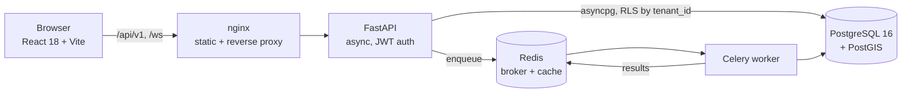

<div align="center">

# 🛰️ Cargonaut

**A logistics control tower — live fleet tracking, dispatch optimization, and multi-tenant operations in one app.**

[](https://nikunjsharma-dev.github.io/cargonaut/)

[](https://python.org)
[](https://fastapi.tiangolo.com)
[](https://postgis.net)
[](https://docs.celeryq.dev)
[](https://react.dev)
[](https://tailwindcss.com)
[](https://docs.docker.com/compose/)
[](LICENSE)


</div>

---

## Table of contents

- [What it is](#what-it-is)
- [Screens](#screens)
- [Architecture](#architecture)
- [Quick start](#quick-start)
- [Project layout](#project-layout)
- [API reference](#api-reference)
- [Data model](#data-model)
- [Background jobs](#background-jobs)
- [Frontend notes](#frontend-notes)
- [Theming](#theming)
- [Configuration](#configuration)
- [Testing & quality](#testing--quality)
- [Deployment](#deployment)
- [Troubleshooting](#troubleshooting)
- [Roadmap](#roadmap)
- [License](#license)

---

## What it is

Cargonaut is a full-stack operations console for a freight fleet. A dispatcher opens one screen and
sees every vehicle, where it is right now, which stops remain, how full it is, and who is driving —
then acts on it without leaving the page.

The tracking screen is a three-pane control tower:

| Pane | Contents |
|------|----------|
| **Navigation** | Account, primary sections, expandable request tree with live counts |
| **Fleet list** | Partner and status filters, per-vehicle countdown timers, waypoint rails, vehicle illustrations |
| **Detail panel** | Cargo capacity, live route map, documents, company, billing, cargo photo proof |

**Dark theme is the default**, with light and system options in Settings. The preference is applied
before first paint, so there is no flash of the wrong theme on load.

### Highlights

- **Live countdowns** — every vehicle card runs its own arrival timer off a single shared interval
- **Waypoint rails** — completed, current, and upcoming stops rendered as a connected timeline
- **Cargo capacity graphics** — inline SVG semi-trailers, box trucks, and vans that fill in proportion
  to their actual load, rendered from CSS variables so they re-theme automatically
- **Leaflet route map** — polylines, animated position markers, and tiles that invert in dark mode
- **Multi-tenancy** — every row carries `tenant_id`, enforced by PostgreSQL Row-Level Security
- **Dispatch optimization** — greedy VRP assignment executed off-request on a Celery worker
- **Zero external chart weight on KPIs** — sparklines are hand-rolled SVG paths, not a chart library

---

## Screens

<table>
<tr>
<td width="50%"><br><em>Tracking — light theme</em></td>
<td width="50%"><br><em>Operations dashboard — KPI sparklines, volume trend, SLA compliance</em></td>
</tr>
<tr>
<td colspan="2"><br><em>Settings — theme picker, tenant profile, security posture</em></td>
</tr>
</table>

---

## Architecture



| Layer | Technology | Why |
|-------|-----------|-----|
| API | Python 3.12 · FastAPI · SQLAlchemy 2.0 (async) | Async all the way down; OpenAPI docs for free |
| Database | PostgreSQL 16 + PostGIS 3.4 | Geofencing and distance math belong in the database |
| Queue | Celery + Redis | Route optimization must not block a request |
| Optimizer | Pandas + greedy VRP heuristic | Readable baseline; swap in OR-Tools for production loads |
| Frontend | React 18 · Vite 6 · Tailwind · TanStack Query · Zustand · Leaflet · Recharts | Fast dev loop, small runtime |
| Auth | JWT bearer carrying `tenant_id` | One token drives both API authorization and RLS |
| Delivery | Docker Compose · nginx · GitHub Actions | Five services up with one command |

In local development the browser only ever talks to port 3000 — nginx proxies `/api/` and `/ws/` to
the API container, so there is no CORS hop to configure.

---

## Quick start

### Everything, via Docker

```bash
git clone https://github.com/NikunjSharma-dev/cargonaut
cd cargonaut
cp .env.example .env
docker compose up --build -d
```

| Service | URL |
|---------|-----|
| App | http://localhost:3000 |
| API docs (Swagger UI) | http://localhost:8000/docs |
| API docs (ReDoc) | http://localhost:8000/redoc |
| Health check | http://localhost:8000/health |
| PostgreSQL | `localhost:5432` |
| Redis | `localhost:6379` |

```bash
docker compose ps                 # service status
docker compose logs -f api        # follow API logs
docker compose up -d --build frontend   # rebuild the UI after a change
docker compose down               # stop (add -v to also drop data volumes)
```

> A freshly created database has **no users**, so login returns `401`. The frontend falls back to a
> demo session so the UI is explorable; seed a real user before using the API for anything.

### Frontend only

```bash
cd frontend
npm install
npm run dev        # http://localhost:3000, proxies /api to :8000
npm run build      # production bundle into dist/
npm run lint
```

### API only

```bash
python -m venv .venv && source .venv/bin/activate
pip install -r requirements.txt
alembic upgrade head
uvicorn app.main:app --reload
```

Celery worker, in a second shell:

```bash
celery -A app.workers.celery_app worker --loglevel=info -E
```

---

## Project layout

```
├── app/                          FastAPI service
│   ├── api/v1/
│   │   ├── endpoints/            auth · users · tenants · orders · drivers
│   │   │                         vehicles · hubs · dispatch · tracking · analytics
│   │   └── router.py             aggregates routers under /api/v1
│   ├── core/
│   │   ├── config.py             pydantic-settings, reads .env
│   │   ├── database.py           async engine, session factory, Base
│   │   └── security.py           bcrypt hashing, JWT issue/verify, role guards
│   ├── models/models.py          SQLAlchemy models, all tenant-scoped
│   ├── schemas/schemas.py        Pydantic request/response contracts
│   ├── services/vrp_optimizer.py greedy vehicle-routing heuristic
│   ├── workers/                  Celery app + scheduled tasks
│   └── main.py                   app factory, middleware, health check
├── frontend/
│   ├── src/
│   │   ├── components/
│   │   │   ├── layout/           Sidebar · TopBar · AppLayout shell
│   │   │   ├── ui.jsx            StatCard, Sparkline, badges, modal, empty states
│   │   │   └── TruckGraphic.jsx  themeable inline-SVG vehicles with load fill
│   │   ├── pages/                dashboard · tracking · orders · dispatch · fleet
│   │   │                         drivers · hubs · analytics · settings · login
│   │   ├── store/                authStore, themeStore (Zustand + persist)
│   │   ├── utils/api.js          axios instance, token interceptor
│   │   └── index.css             design tokens for both themes
│   ├── nginx.conf                SPA fallback + API/WS proxy
│   └── Dockerfile                multi-stage node build → nginx
├── analytics/sql_views/          reporting views for BI tools
├── infra/                        API Dockerfile, DB init, Prometheus config
├── migrations/                   Alembic
├── tests/                        pytest suite
├── docker-compose.yml            db · redis · api · worker · frontend
└── DEPLOYMENT.md                 hosting options and production checklist
```

---

## API reference

All routes are namespaced under `/api/v1` and require a bearer token except `auth/login`,
`auth/register`, and `/health`. Full interactive docs at `/docs`.

| Group | Endpoints |
|-------|-----------|
| **Auth** | `POST /auth/login` · `POST /auth/register` · `GET /auth/me` |
| **Tenants** | `GET /tenants/me` |
| **Users** | `GET /users/` · `POST /users/` · `PATCH /users/{id}` |
| **Orders** | `GET /orders/` · `POST /orders/` · `GET|PATCH|DELETE /orders/{id}` |
| **Drivers** | `GET /drivers/` · `POST /drivers/` · `GET|PATCH|DELETE /drivers/{id}` |
| **Vehicles** | `GET /vehicles/` · `POST /vehicles/` · `GET|PATCH /vehicles/{id}` |
| **Hubs** | `GET /hubs/` · `POST /hubs/` · `GET|PATCH|DELETE /hubs/{id}` |
| **Dispatch** | `POST /dispatch/optimize` · `POST /dispatch/assign/{order_id}/driver/{driver_id}` |
| **Tracking** | `GET /tracking/drivers/live` · `POST /tracking/ping` |
| **Analytics** | `GET /analytics/dashboard` · `/analytics/fleet/utilization` · `/analytics/orders/daily-volume` · `/analytics/orders/status-breakdown` |

Example:

```bash
TOKEN=$(curl -s -X POST http://localhost:8000/api/v1/auth/login \
  -H 'Content-Type: application/json' \
  -d '{"email":"ops@cargonaut.io","password":"..."}' | jq -r .access_token)

curl -s http://localhost:8000/api/v1/tracking/drivers/live \
  -H "Authorization: Bearer $TOKEN" | jq
```

---

## Data model

Seven tables, every one scoped by `tenant_id`:

| Model | Purpose |
|-------|---------|
| `Tenant` | The organization. Root of every RLS policy. |
| `User` | Operator accounts, `UserRole` (admin / dispatcher / viewer) |
| `Hub` | Depots and warehouses, `HubType`, PostGIS location |
| `Vehicle` | Fleet assets, `VehicleType`, `VehicleStatus`, `FuelType`, capacity |
| `Driver` | Roster, availability, current assignment |
| `Order` | Shipments, `OrderStatus`, pickup/dropoff geometry, weight, priority |
| `GPSPing` | Telemetry stream, indexed by driver and timestamp |

Isolation is enforced in the database, not just the query layer: the JWT carries `tenant_id`, the
session sets it, and Row-Level Security policies filter every statement.

---

## Background jobs

Celery tasks in `app/workers/tasks.py`:

| Task | What it does |
|------|--------------|
| `run_vrp_optimization` | Assigns pending orders to available drivers by capacity and proximity |
| `run_power_bi_etl` | Refreshes the reporting views consumed by BI tools |
| `flush_gps_buffer` | Drains buffered GPS pings into Postgres in batches |
| `check_sla_deadlines` | Flags shipments at risk of breaching their delivery window |

---

## Frontend notes

Two implementation details worth knowing before editing:

**Sparklines are hand-rolled SVG.** `ResponsiveContainer` mis-measures inside an ~80×36 box and paints
a surface that escapes its container. `Sparkline` in `components/ui.jsx` computes a smoothed bezier
path directly — deterministic size, no measurement pass, no clipping dependency. Recharts is still
used for full-size charts where it behaves correctly.

**Vehicle illustrations are data, not images.** `TruckGraphic.jsx` draws three variants (`semi`,
`box`, `van`) from SVG primitives coloured by CSS variables, with an optional `fillPercent` cargo
overlay anchored toward the cab. Nothing to re-export when the palette changes.

---

## Theming

Colors live in one place. `frontend/src/index.css` defines the light palette on `:root` and overrides
it under `.dark`; Tailwind's semantic tokens (`bg-app-surface`, `text-heading`, `border-app-border`,
`bg-app-panel`, `text-muted`, …) resolve to those variables, so both themes move together from a
single edit. Map tiles invert via a CSS filter and the vehicle SVGs read the same variables.

Re-brand the entire app:

```css
/* frontend/src/index.css */
:root { --primary: #e8606d; }   /* light */
.dark { --primary: #f06d79; }   /* dark  */
```

Theme resolution order: `localStorage` → `system` (via `prefers-color-scheme`) → `dark`. Users pick
in **Settings → Appearance**, or use the sun/moon toggle in the top bar.

---

## Configuration

Copy `.env.example` to `.env`. Key variables:

| Variable | Purpose | Example |
|----------|---------|---------|
| `DATABASE_URL` | Async Postgres DSN (**asyncpg driver**) | `postgresql+asyncpg://user:pass@db:5432/app` |
| `REDIS_URL` | Cache / pub-sub | `redis://redis:6379/0` |
| `CELERY_BROKER_URL` | Task queue | `redis://redis:6379/1` |
| `CELERY_RESULT_BACKEND` | Task results | `redis://redis:6379/2` |
| `SECRET_KEY` | JWT signing key — regenerate for production | `openssl rand -hex 32` |
| `ALLOWED_ORIGINS` | CORS allowlist, comma-separated | `https://user.github.io` |
| `ALLOWED_HOSTS` | Trusted host header values | `api.example.com` |
| `DEBUG` | Verbose errors and SQL echo | `false` in production |

Frontend build-time variables (Vite inlines these — rebuild after changing):

| Variable | Purpose |
|----------|---------|
| `VITE_API_URL` | Absolute API base. Omit to use the relative `/api/v1` through nginx. |
| `VITE_BASE` | Public base path, set to `/<repo>/` for GitHub Pages |

---

## Testing & quality

```bash
pytest                       # API tests
ruff check app/              # lint (rules in pyproject.toml)
ruff check app/ --fix        # auto-fix
cd frontend && npm run lint  # frontend lint
```

CI (`.github/workflows/ci.yml`) runs the linter and the test suite against a Postgres service
container on every push and pull request.

---

## Deployment

The frontend deploys to **GitHub Pages** automatically on every push to `main` touching `frontend/`
(`.github/workflows/deploy-pages.yml`). It injects the project base path, builds, and writes a
`404.html` SPA fallback so deep links resolve.

> **GitHub Pages is static hosting — it serves the UI only.** The FastAPI service, Postgres, Redis,
> and Celery worker need a host that runs processes. [`DEPLOYMENT.md`](DEPLOYMENT.md) compares
> Render, Neon + Upstash + Fly.io, and Railway, covers the Celery-on-serverless-Redis trap, and lists
> the production checklist.

---

## Troubleshooting

| Symptom | Cause and fix |
|---------|---------------|
| App renders unstyled | `frontend/postcss.config.cjs` missing — Tailwind never compiles without it |
| Docker build fails on esbuild platform | Missing `.dockerignore`; host `node_modules` overwrote the container's Linux binaries |
| Login returns 401 | Fresh database has no users. Seed one, or use the demo session |
| `/api/...` 404 through nginx | Routes live under `/api/v1/...`; check the path prefix |
| Deep links 404 on Pages | `404.html` fallback missing, or `VITE_BASE` not set to `/<repo>/` |
| Map tiles blank | Leaflet tiles come from CARTO — network egress required |
| Worker idle but Redis bill climbing | Celery polls the broker; see the caveat in `DEPLOYMENT.md` |

---

## Roadmap

- [ ] Seed script for demo tenant, users, fleet, and orders
- [ ] Swap the greedy heuristic for OR-Tools with time windows
- [ ] WebSocket GPS stream wired to the tracking map (endpoint exists, UI polls today)
- [ ] Driver-facing PWA with offline proof-of-delivery capture
- [ ] Geofence entry/exit events via PostGIS triggers
- [ ] E2E tests (Playwright) over the tracking flow

---

## License

MIT — see [LICENSE](LICENSE).
